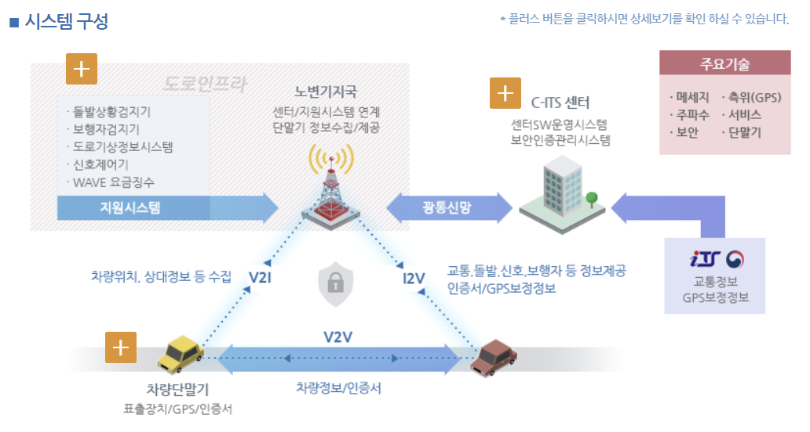

# 딥러닝 통한 CCTV에서의 객체 위치 탐지 기술 동향

##### 정보컴퓨터공학부 202055582 이지은

---
> 요약 - 카메라 센서인 CCTV에서 동적 객체의 위치를 파악하는 기술은 자율 주행 자동차에 사각지대의 정보를 제공해 안전성 개선에 도움이 될 것으로 기대된다. 이 글에서는 여러 연구 실험 자료를 통해 CCTV에서의 객체 위치 탐지 기술의 발전 동향을 살펴보고, 사용되는 주요 딥러닝 모델을 비교해 본다. 위치 탐지 기술의 발전 동향을 조사해 본 결과, 주로 사용되는 딥러닝 모델이 CNN에서 YOLO로 변화하며 속도, 정확성 면에서 개선되고 있음을 확인하였다.

## 서론

&emsp; CCTV를 이용한 객체의 위치 탐지 및 시각화를 위한 노력은 자율 주행 자동차의 상용화를 위해 지속해서 이어지고 있다. 카메라 센서인 CCTV를 통한 객체 위치 동기화 기술의 발전 동향 및 사용되는 알고리즘에 대해 연구 자료를 통해 알아보고자 한다.     
&emsp; 현재 주목 받는 자율 주행 기술이 완전 자동화 단계에 가까워지기 위해서는 C-ITS 기술의 발전이 필수적이다. C-ITS란 V2X(vehicle to everything) 통신을 이용해 차량간(V2V), 차량-인프라간(V2I)의 양방향 정보 교환이 가능하도록 연결해 주는 시스템을 말하는데, 이를 통해 도로 위의 위험 요소나 돌발 상황 등에 신속하게 대응할 수 있기에 자율 주행의 핵심 기술로 주목받고 있다.    
&emsp; C-ITS의 도로 인프라 센서에는 카메라, 라이다(Lidar), 레이더(RADAR)가 포함되는데, 이들은 자동차에 탑재되어 신뢰성 있는 자율 주행을 지원한다. 주변에서 흔히 볼 수 있는 CCTV는 카메라 센서에 해당한다. 그런데 CCTV의 경우, 이미 잘 구축되어 있음에도 불구하고 단순히 모니터링에만 이용되는 등 활용도가 매우 떨어지는 문제가 있다. CCTV가 물체를 인식하고 이들의 위치에 대한 정보를 얻어낼 수 있다면 C-ITS 서비스에 다양한 형태로 활용할 수 있을 것으로 기대된다.    
&emsp; 현재 구축된 CCTV에 이 기술을 실제로 적용한다면, 거의 모든 도로 위의 상황을 효율적으로 파악할 수 있을 것이다. 또, 자율 주행 자동차에 이 정보를 통합시킬 수 있다면 사각지대의 정보도 제공해 줄 수 있어 자율 주행 자동차의 안전성을 훨씬 높일 수 있을 것으로 기대된다.    

 Figure1. C-ITS 시스템의 구성 

## 본론
&emsp; 여러 가지 논문을 이용해 기술 발전 동향에 대한 조사를 진행하였으며, 범위를 2018년부터 현재까지로 지정하여 어떤 연구를 통해 기술 발전이 이루어지고 있는지 알아보았다. 추가로, 사용되는 주요 딥러닝 모델간의 비교를 통해 어떤 발전이 있는지 살펴보고자 한다.   

####1.CNN을 이용한 객체 탐지 방법

&emsp; 2018년에는 딥러닝을 이용해서 CCTV 영상 내의 차량 및 보행자의 수를 정확히 검출하기 위한 기술 연구가 진행된 바 있다. 기존의 영상처리 알고리즘은 조도 변화와 화질 열화에 약한 성능을 보였기에, 딥러닝 알고리즘 중 CNN(Convolutional Neural Network, 합성곱 신경망)을 이용해 CCTV 영상 기반 차량 및 보행자 계수 정확성을 향상하고자 하는 움직임이 있었다.   
